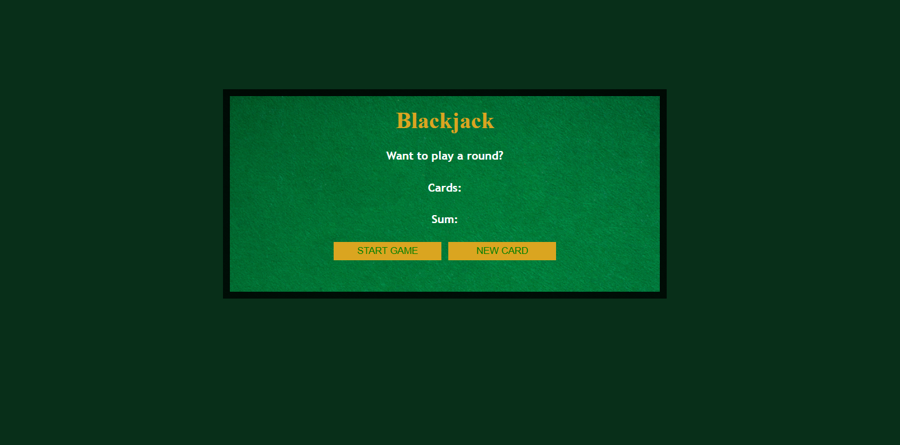
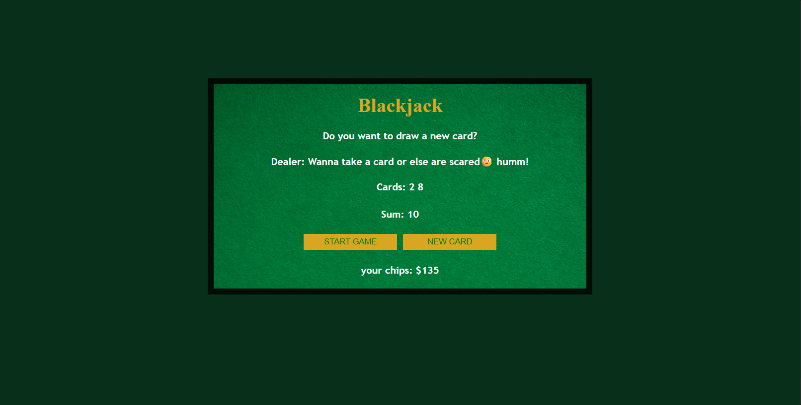
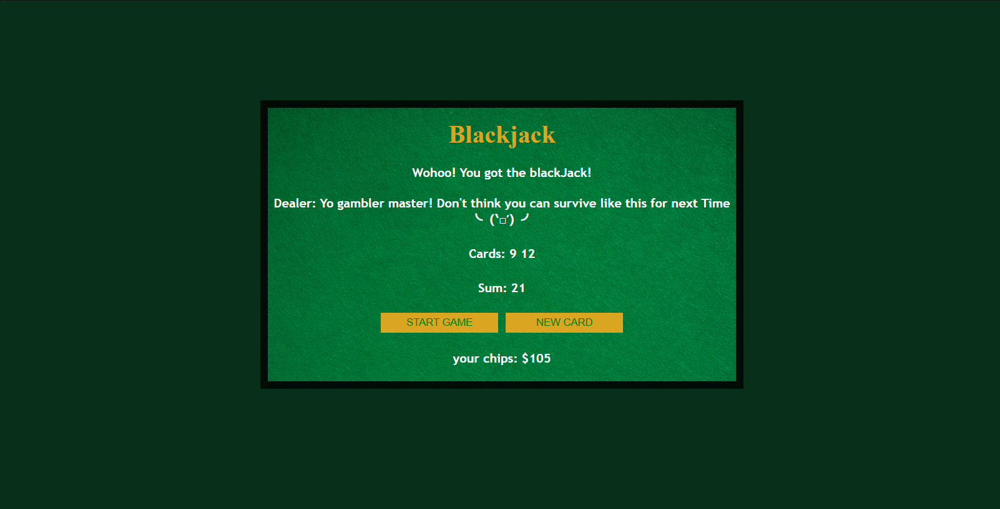

# 🃏 Blackjack Game

A simple **Blackjack Game** built with **HTML, CSS, and JavaScript**. Draw cards, beat the dealer, avoid busting, and try to hit **21**!

## 🚀 Live Demo

🔗 **Play Here:** https://your-demo-link.netlify.app

---

## 📸 Screenshots

### 🎮 Home Screen

### 🃏 Gameplay

### 🏆 Blackjack / Game Over

---

## 📜 Rules

- 🎯 Reach **21** to win.
- 🃏 Number cards are worth their face value.
- 👑 Face cards are worth **10**.
- 🅰️ Ace counts as **1** or **11**.
- 💥 Going over **21** means you bust.

---

## ✨ Features

- 🃏 Random card generation
- 🅰️ Ace, Jack, Queen & King support
- 💰 Simple betting system
- 🎲 Draw new cards
- 🏆 Blackjack detection
- 💥 Bust detection
- 🎭 Interactive dealer messages
- 📱 Responsive layout

---

## 🛠️ Built With

- HTML5
- CSS3
- JavaScript (ES6)

---

## 📚 What I Learned

- DOM Manipulation
- Arrays & Objects
- Functions
- Conditional Statements
- Random Number Generation
- Event Handling
- Basic Game State Management

---

## 👨‍💻 Author

**Nova**

⭐ If you enjoyed this project!